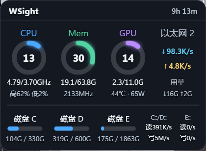
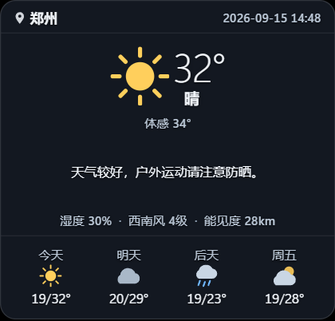
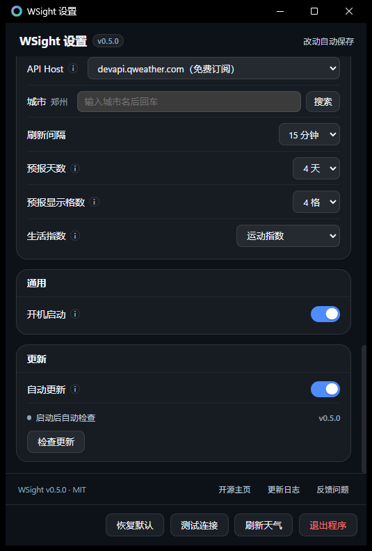

# WSight

Windows 桌面悬浮组件：**硬件监控面板 + 和风天气面板**。
Tauri 2 + React 18 + Rust，两个无边框悬浮窗常驻桌面，托盘图标管理。




## 功能

**监控面板**（四列竖排，每列圆环 + 两行数据）

| 列 | 内容 |
| --- | --- |
| CPU | 实时频率 / 额定频率、占用率、最高核 / 最低核占用 |
| 内存 | 已用 / 总量、DDR 频率 |
| GPU | 占用率、显存已用 / 总量、温度 · 功耗 |
| 网络 | **真实网卡名**、实时上下行速率、累计上下行总量 |

下方磁盘块：左侧按**卷**显示容量占用（自选，最多 3 个），右侧按**物理硬盘**显示读写速度（自选，最多 2 块）。

**天气面板**

和风天气（QWeather）的实况 / 7 天预报 / 交通指数。API Key 由使用者自己申请并填进设置窗口，不内置。

**设置窗口**

主题（深/浅）、背景不透明度、圆角、四个环的配色、窗口宽度、采样间隔、天气刷新间隔、城市搜索。所有改动 450ms 防抖自动保存，并立即应用到两个悬浮窗。

**自动更新**

启动 15 秒后查一次 GitHub 上的最新版本，之后每 6 小时一次，查到就悄悄下载好；
**装不装由你决定** —— 设置里点「重启更新」才替换。可以整个关掉。



**交互**

右键菜单：调整 / 置顶 / 设置。默认锁定（不可拖动、不可缩放）避免误触，进入「调整」模式后才可拖动和缩放；窗口位置会记忆。

## 一些实现细节

硬件数据全部走系统调用，没有 PowerShell / WMI 轮询，也没有为此新增 crate：

- **CPU 实时频率**：`sysinfo` 在 Windows 上读的是 `CallNtPowerInformation` 的 `CurrentMhz`，**恒等于额定频率**（面板上那个数永远不动）。改用 PDH 计数器 `\Processor Information(_Total)\% Processor Performance` 乘额定频率，得到会随睿频变化的真实值。
- **内存频率**：`GetSystemFirmwareTable('RSMB')` 解析 SMBIOS type 17。注意这个 provider 签名是多字符常量，**必须按大端打包**（`'RSMB'` = `0x52534D42`），写成小端会返回 0 而被误判成「被系统拦截」。
- **卷 → 物理硬盘**：`IOCTL_STORAGE_GET_DEVICE_NUMBER`（不需要管理员权限）。
- **磁盘吞吐**：`IOCTL_DISK_PERFORMANCE`，它是**按卷**统计的，所以「某块物理硬盘的读写」要把该盘上所有分区相加（比如 C+D 同属一块 NVMe）。
- **显卡信息**：NVIDIA 走 NVML；其它厂商读注册表 `HardwareInformation.qwMemorySize` 拿型号与显存总量，实时占用率走 PDH `\GPU Engine(*)\Utilization Percentage`（和任务管理器同源）。**有多少说多少**：占用率读不到就显示 `--/11.0G`，不写 0。

## 自己换掉自己（无安装包更新）

WSight 是一个绿色 exe，更新靠替换自己。整个机制只立在一句话上：
**Windows 不允许覆盖正在运行的程序，但允许给它改名。** 于是换版就是

```
WSight.exe      -> WSight.exe.old-0.5.0
WSight.exe.new  -> WSight.exe
启动新的 WSight.exe --handover --replaced <旧文件>，自己退出
新的那个删掉 .old-* 收尾
```

两个不显然的地方：

- **文件名固定不变**。路径从头到尾没动，开机启动项、快捷方式、下一次更新说的都是同一个文件。也因此 **Release 附件名必须一直是 `WSight.exe`**（`scripts/pack.mjs` 保证这点）。
- **新的进程一开始是"重复实例"**。单实例互斥量由旧进程握着，它必须死掉才能放；所以新的带 `--handover` 启动，**等互斥量消失**再进场，而不是一看到"已有实例"就退出 —— 否则更新完就什么都没有了。

下载会核对 GitHub 给出的 sha256（附件没有 `digest` 时只核对大小，界面上会写明"仅核对文件大小"，不假装校验过）。
包放在 exe 同目录（跨盘改名不成立），目录不可写时才退回 `%APPDATA%` 再复制过去。

## 读不到的东西（以及为什么不假装能读）

- **CPU 温度 / 功耗**：OS 层唯一来源是 WMI `MSAcpi_ThermalZoneTemperature`，本机热区被主板冻在 27.9℃（压到 63% 负载也纹丝不动）；真实功耗要读 MSR RAPL，需要内核驱动。
- **内存温度 / 功耗**：DDR4 没有温度传感器，SPD Hub 是 DDR5 才有的。
- **显存温度**：GDDR6 无此传感器。

所以 CPU 第二行给的是「最高核 / 最低核占用」，内存第二行给的是 DDR 频率 —— 用能真实读到的量回答「是不是单核跑满了」这类问题，而不是编一个数字。

## 构建

前置：Node 22+、pnpm、Rust 1.77+、WebView2 Runtime。

```bash
pnpm install
pnpm build                        # tsc --noEmit + vite build
pnpm tauri build --no-bundle
pnpm dist                         # 把产物复制成根目录的 WSight.exe，并打印 sha256
```

`--no-bundle` 不会按 `productName` 改名，`pnpm dist` 顺手做了这件事 —— 名字必须是
`WSight.exe`（自更新按固定名替换，见下一节），发布时也用它当附件名。

> **不要只用 `cargo build --release`**。Tauri CLI 才会开启 `custom-protocol` feature；缺少它时 `tauri-macros` 按 `dev: true` 编译，三个窗口会去连 `http://localhost:1420`，表现为「无法访问此页面 / ERR_CONNECTION_REFUSED」。

版本号在四处重复（`package.json`、`src-tauri/tauri.conf.json`、`src-tauri/Cargo.toml`、`src/shared/about.ts`），用 `pnpm check:version` 校验它们是否一致。

## 配置

配置文件在 `%APPDATA%\WSight\config.json`，一般通过设置窗口修改，不用手改。
天气功能需要到 [和风天气](https://dev.qweather.com/) 申请免费 Key 并在设置里填写。

## 许可

[MIT](LICENSE) © 2026 WW-Ares
